# **RecipeShare**

Cooking is a highly enjoyable activity, that can really bring people together and most cooking enthusiasts have at least a few unique recipes they are proud of and would happily share with others. The RecipeShare web application was created to help users achieve this goal by becoming part of a knowledgeable and helpful community.

This website was created for Portfolio Project 5 (Advanced Front End) as part of the Diploma in Full Stack Software Development program of the [Code Institute](https://www.codeinstitute.net). However the aim was to create a fully functional social media website with a real life application that would fulfill its purpose and would be to able meet the needs of its' users.

The live website can be found [here](https://recipe-share-sb-38760b27e610.herokuapp.com/).
The GitHub repository for the project can be found at: [RecipeShare Front End Repository](https://github.com/stevebiczyk/pp5-recipe-share-sb)

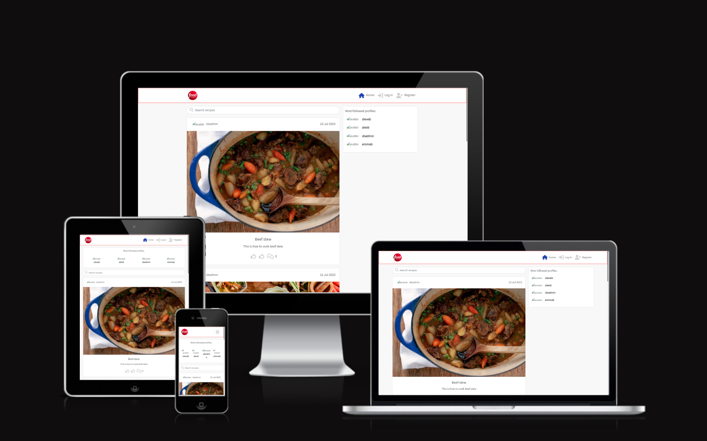

# [Table of Contents](#table-of-contents)

- [**Project**](#project)
  - [Objective](#objective)
  - [Site User's Goal](#site-users-goal)
  - [Site Owner's Goal](#site-owners-goal)
  - [Project Management](#project-management)
- [**User Experience (UX)**](#user-experience-ux)
  - [Wireframes](#wireframes)
  - [User Stories](#user-stories)
  - [Site Structure](#site-structure)
  - [Design Choices](#design-choices)
- [**Existing Features**](#existing-features)
  - [Authentication](#authentication)
  - [Homepage](#homepage)
  - [Feed](#feed)
  - [Create a recipe](#create-a-recipe)
  - [Votes](#votes)
  - [Comments](#comments)
  - [Categories](#categories)
  - [Profile Page](#profile-page)
  - [Followers](#followers)
- [**Future Implementations**](#future-implementations)
- [**Technologies Used**](#technologies-used)
  - [Languages](#languages)
  - [Frameworks & Software](#frameworks--software)
  - [Libraries](#libraries)
- [Testing](#testing)
- [Deployment](#deployment)
- [Credits](#credits)
- [Acknowledgements](#acknowledgements)

# **Project**

## Objective

The objective of this project was to create a web application where people can share recipes to inspire other users or find recipes they themselves can recreate.

## Site User's Goal

A typical user of this site would be have a strong interest in exploring a variety of recipes and share recipes of their own they feel would provide other users a unique and worthwhile culinary experience. They would want to have an enjoyable and enriching culinary experience on RecipeShare. They aspire to be part of an active and supportive community, discover new and delicious recipes, share their cooking expertise, and improve their skills as home cooks and food enthusiasts.

## Site Owner's Goal

The site owner's goal for RecipeShare is to create a thriving and popular online platform that caters to food enthusiasts, home cooks, and culinary professionals alike. The site owner envisions RecipeShare as a leading destination for recipe sharing, cooking inspiration, and community engagement. The main objectives of the site owner include:

[Back to top](#table-of-contents)

## Project Management

### GitHub Project Board

I started the project by creating a set of user stories that upon completion would be able to provide the visitors with a fulfilling user experience. Many of these user stories were already documented for the back and API, however I included them for the front end as well as I considered both parts to be essential for the complete user experience.
The project board can be found [here](https://github.com/users/stevebiczyk/projects/7)

## User Stories

I used a GitHub project board to list and keep track of the user stories for the frontend application. User stories were grouped according to their importance to provide functionality and aid usability of the website. The 3 groups of importance were: Must haves, Should haves and Nice to haves.

### NavBar User Stories

- As the developer I want create a navigation bar so that users can easily access all the pages of the site.
- As the developer/ user I want a navigation bar that's accessible on all types and sizes of devices.
- As a user I want to be able to click on each navbar icon so that I view the page I want to access.

### Homepage User Stories

- As the developer I want to create a homepage where users can log in / register and see site information so that they can access all pages of the website.
- As a user I want to create an account so that I can post my own recipes and see other users' recipes and profiles.
- As a user I want to log into my account so that I can access all the functionality of the website.
- As a logged in user I want to see a list of recipes so that I find the ones I'm interested in.
- As a logged in user I want to click on a specific recipe so that I can see all the relevant details.
- As a logged in user I want to see a 'post recipe' button so that I can create a new recipe and add the relevant information.
- As a logged in user I want to see a search bar so that I can search for recipes by keyword.
- As a logged in user I can view the 'popular profiles' section so that I can see profiles of other users and choose to follow them.

### Profile User Stories

- As the developer I want to create a Profile section so that users can edit their personal information and upload a profile image.
- As a user I want to post my profile  so that other users can read relevant information about me.
- As a user I want to upload a picture so that other users can see my profile image.
- As a user I wan to edit my own profile so that the information always remains updated and correct.
- As a user I want to view other users' profiles so that I can see their posts and profile details.

### Votes User Stories

- As the developer I want to create a Votes section so that users can vote on recipes according to their personal experience.
- As a user I want to vote on a recipe so that others can easily see my experience with that recipe.
- As a user I want to be able to change or delete my vote so that I can correct mistakes or remove votes that no longer reflect my experience.
- As a user I want to be able to see other users vote so that I can gauge their experience with that recipe.
- As a user I want to be able to see the total number of up and downvotes so that I can quickly gauge the users' overall engagement and experience with that recipe.

### Comments User Stories

- As the developer I want to create a Comments section so that users can add further information to each recipe.
- As a user I want to comment on an a recipe so that I can provide other users with further relevant information.
- As a user I want to view other users' comments on an event so that I can gain more information about a certain recipe.
- As a user I want to edit my comments so that errors can be corrected or further information can be given.
- As a user I want to delete my own comments so that erroneous or irrelevant information can be removed.

### Followers User Stories

- As the developer I want to create a Followers section so that registered, logged in users can follow and unfollow other users.
- As a user I can follow another registered user so that I can view their profile on my feed page.
- As a user I can unfollow another registered user so that their profile information will no longer be visible on my feed page.
- As the developer I can create follow / unfollow buttons so that registered, logged in users can follow and unfollow other users.

[Back to top](#table-of-contents)

# **User Experience (UX)**

## Wireframes

The wireframes for the project were created using [Figma](https://www.figma.com/). Wireframes have been created and included for both desktop and mobile devices. The application itself is responsive for desktop, tablet and mobile-sized devices.

The layout is based the Moments walkthrough project, including a navigation bar with registration and login features, the activities section in the middle as posted events and on the right, on a desktop device, a list of most followed profiles. On smaller devices, the navbar becomes a hamburger menu, the most followed profiles move to the top of the page and the events are underneath. This layout was chosen for ease and because the information translates well through various device sizes. I found this layout easy to navigate from my desktop, laptop and mobile.

## Site Structure

The RecipeShare website's home page is accessible to both logged in and non-logged in users. Non-logged in user can access the list of recipe, The Search bar and the Home, Log On and Register Nav Links. Logged in users can access the full Nav Bar functionality which includes their Feed, Votes, Sign Out link and a link to their Profile. They can also access the Add Recipe button which enables them to post recipes to the site.

## Site Design

### Colour Scheme

### Typography

The main font I used on this site is 'Source Sans 3', with Sans-Serif as the backup.

[Back to top](#table-of-contents)

# **Existing Features**

## Navigation

The navigation bar is located at the top and stays accessible as the user scrolls down the pages. Logged out and logged in users see different icons and have access to different pages. The navigation bar collapses into a hamburger dropdown menu with the site icon to the far left when viewed on mobile or tablet sized devices.

For non-logged in users the following menu is visible:

- RecipeShare Logo - Located on the left hand side of the navigation bar. This logo is visible on all pages of the site. Clicking the logo will return the user to the homepage.
- Homepage - The first menu icon and the landing page of the site is the homepage. Here, the user can see all recipes, their titles and user comments. Below the navigation bar there is a search bar where users can search for recipes by keyword or author. On the right-hand side, there is a box containing a list of the most followed profiles.
- Authentication - Users can either register an account or log into their existing one. Clicking either of these icons will take users to the corresponding page.

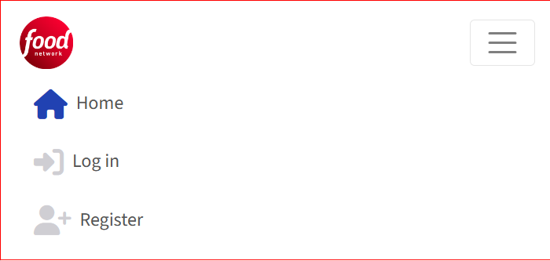

Once logged in, the user will see additional icons and be able to navigate to those pages. Those include:

- Add a new recipe - This is the page where users can post their recipes. When the user clicks on the icon, a new page containing a form will open. On this page, the user can add a photo and create a new recipe by entering the necessary details. These are as follows:
- Title: the title of the recipe
- Ingredients: The necessary ingredients for the recipe and their respective amounts.
- Instructions: The necessary instructions for the recipe.
- Cooking time: The required amount of time for the recipe.
- Difficulty level: A dropdown box where the user can select the difficulty level of their recipe. The choices are: Easy, Medium and Hard.
- Feed - Here users can see a list of recipes. This page looks very similar to the Homepage, with the Search bar and Most followerd profiles sections also visible.
- Votes - This page shows all the recipes the logged-in users has voted up or down. Clicking on the thumbs up or thumbs down icons will remove the vote.
- Sign Out - Clicking on the icon will sign out the logged-in user and return them to the Home page where the Nav Bar will return to the Logged Out view.
- Profile - This is the link to the user's own profile page and it will display their avatar image or the default avatar image if they didn't upload one. Clicking the avatar will bring them to their profile page where they can see all their information and update their profile. Users can edit their profile, updating the avatar image and their bio information.

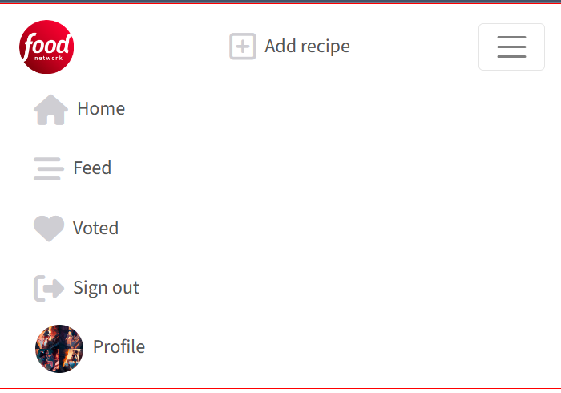

[Back to top](#table-of-contents)

## Authentication

### Registration

New visitors to the site or those without an account can click the Register icon on the Navbar and will be directed to the Register page where they can create an account. They'll be asked to enter a username, a password and confirm the password.

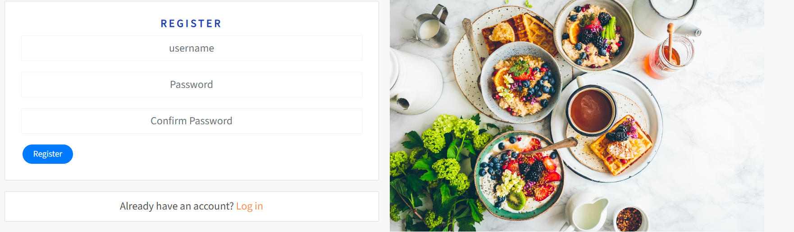

### Log in

A registered user can enter their username and password and gain access to the additional features of the site.

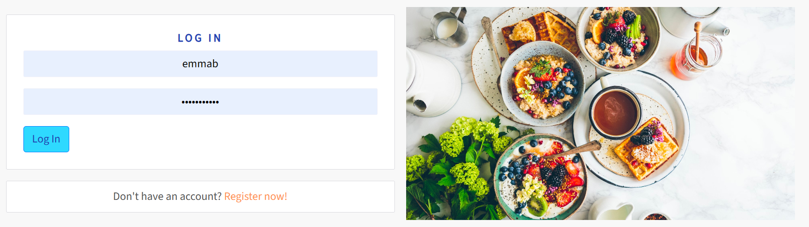

### Log out

Once logged in, the user can sign out by clicking on the 'Log out' icon in the navigation bar.

## Homepage

The main components of the homepage are:

1. Search bar
2. List of posted recipes
3. Most followed profiles

### Search Bar

The user can enter a keyword or the author of a recipe into the search bar, which will then return the relevant information.

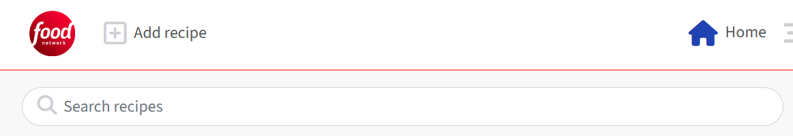

### Recipes

Recipes created on the platform are all displayed on the homepage, ordered by created date in descending order. Each recipe includes an image and a title, the author, the date created and the votes and comments specific to the recipe. This data is stored in the backend API. Clicking on the recipe image or the comments icon will take the user to the recipe details page where they view further details and vote or leave a comment.

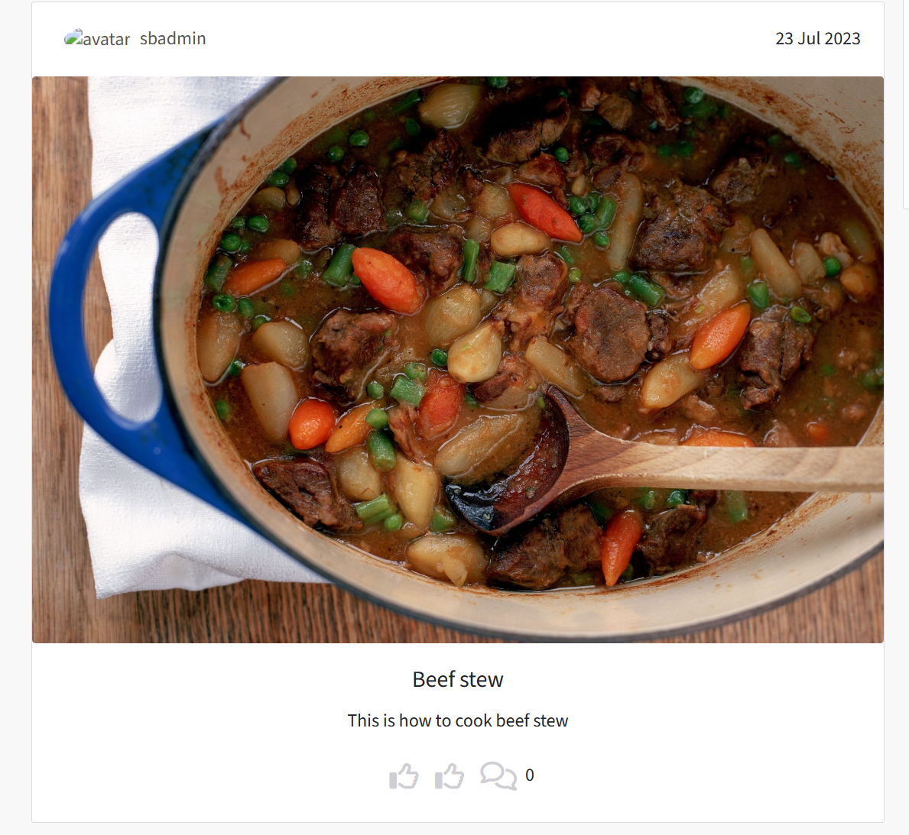

[Back to top](#table-of-contents)

### Most Followed Profiles

The most followed profiles component is visible throughout the website, regardless of login status. If users are logged in, they're able to follow or unfollow other users, via buttons next to the person's profile avatar and username on desktop or laptop devices. Users are unable follow themselves as no button appears next to their avatar. This feature filters users by follower count, from highest to lowest, which is the order the avatar will appear in the list. Clicking the profile avatar will allow you to view that user's full profile.

The layout is different for mobile devices as the section appears at the top of the page under the navigation bar instead of the right-hand side of the page. Four profiles are shown in the tablet and mobile version and six for the desktop version and users on tablet or mobile devices have to click the person's avatar to follow them as the buttons are only visible in the desktop version.

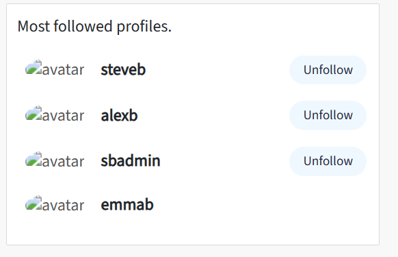
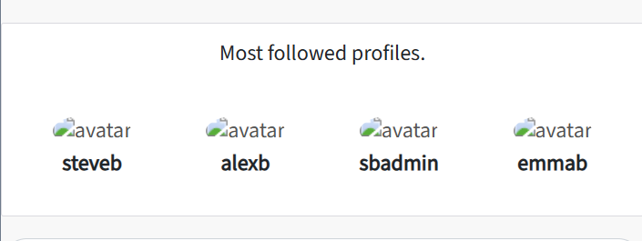

## Add a recipe

Once a user is logged in, they can post a recipe on the platform. After clicking the 'Add a recipe' button in the navigation bar they will be taken to the Add Recipe form where they can create a new recipe by filling on the required details (see above for description). Clicking the "Create" button will save the data in the API and will post the recipe to the homepage. Once the recipe is created, users will be able to see it on the home page and in their feed.

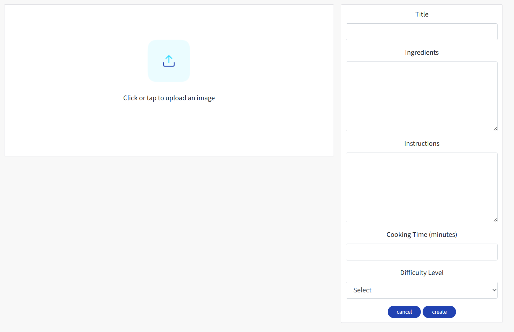

### Recipe Details Page

Users can access a detailed view of any recipe by clicking the recipe's image. This will take them to the Recipe page where they can see all the information posted by the recipe's creator. They will be also be able to vote and comment on the recipe if they are logged in. If they are not logged in, they will be prompted to do so before they can vote or comment.

The user who created the recipe can also edit it from this page by clicking the Edit icon. This will take them back to the Recipe form where the fields will be pre-populated with the existing information. The user can change the required details and save the information, which will be updated in the API and on the homepage.

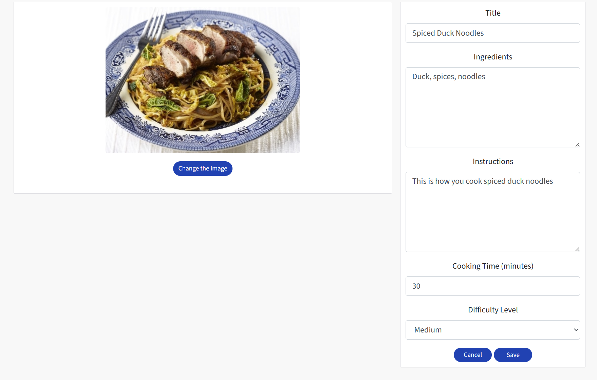

The creator can also delete their recipe by clicking on the bin icon on the Recipe Detail page. This action will remove the recipe from the API and from the homepage and it is irreversible.

Under the recipe's details there's a comment section that will show other users' comments, if there are any. If not, a message will be displayed.

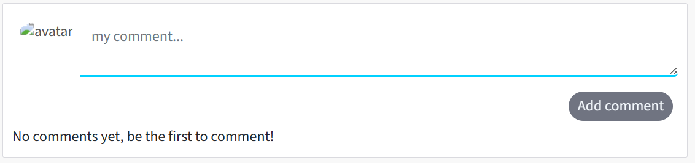

Logged out or unregistered users can view comments though they won't be able to leave one until they log in. If there are no comments, a similar message will be displayed but the user will not be prompted to leave a comment. They can only do this when they've logged in.

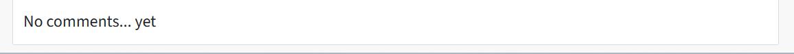

All comments posted are visible to all users, regardless of login status. The logged in user will see a comment edit form above the existing comments where they can post their own comment or question about the recipe.

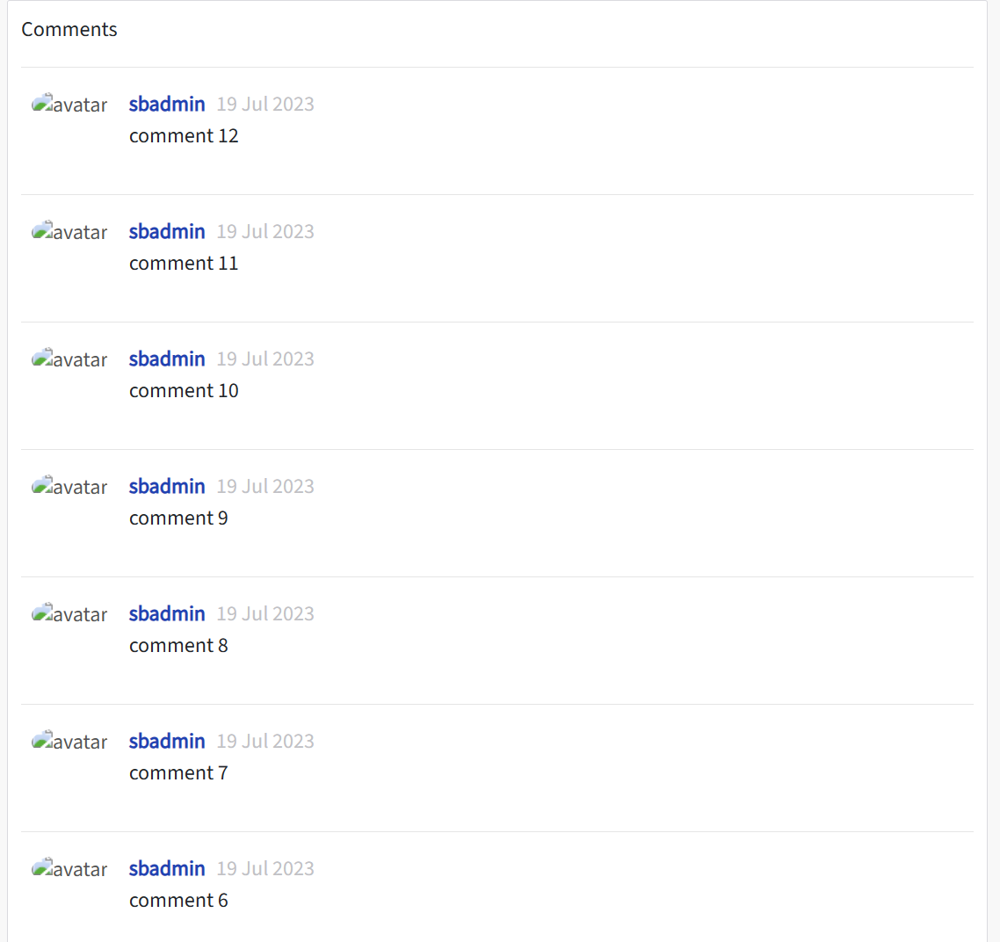

[Back to top](#table-of-contents)

## Feed

The feed page looks almost identical to the Home page. The main difference is that the feed section only shows recipes posted by users followed by the logged in user and . If the logged in user is not following anyone, the 'no-results' image and message will appear.

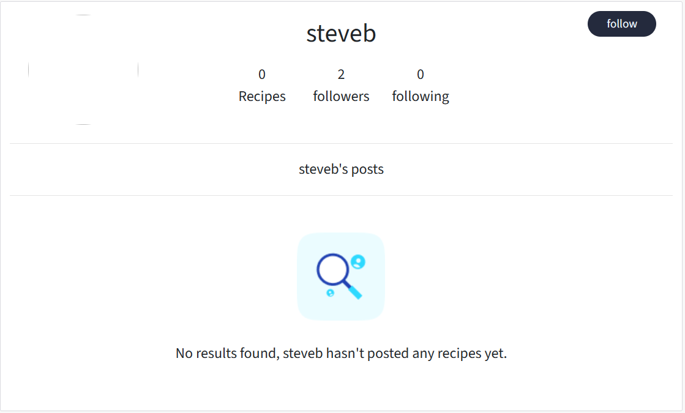

## Votes

The 'Votes' page shows a list of recipes a logged-in user has voted on. The user can click a 'thumbs up' icon to upvote a recipe they like or a 'thumbs down' icon for a recipe they don't like so much.The click will also result in the count for the relevant type vote going up. A second click on the same icon will result in the count going back down by one and the recipe disappearing from the 'Votes' list.

## Profile Page

Clicking on the avatar image of a user will redirect to the profile page for that user. There you will see the option to follow / unfollow them, how many recipes they've posted, the number of followers they have, the number of other users they're following and their recipes.

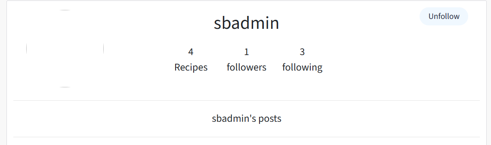

The logged in user can access their profile page by clicking on their avatar. There they will see the recipes they posted and have the option to edit their profile.

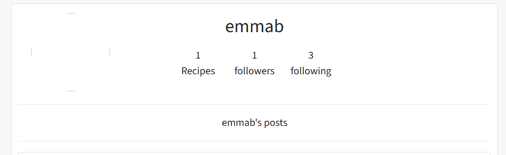

Clicking the pencil icon will let you select one of three option: edit profile, change username or change password. Choosing to edit your profile will take you to a page where you can change your bio information or avatar image.

## Future Features

- Add a 'Forgot Password' feature
- Add a 'Change Password' feature

## Technologies Used

### Languages

- [HTML5](https://developer.mozilla.org/en-US/docs/Web/HTML) - Used for adding content and structure to the website.
- [CSS3](https://developer.mozilla.org/en-US/docs/Web/CSS) - Used for styling the website.
- [JavaScript](https://developer.mozilla.org/en-US/docs/Web/JavaScript) - Used to add functionality to the website.
- [React.js](https://react.dev/) - Used for creating reusable frontend components.

## Frameworks & Software

- [React Bootstrap](https://react-bootstrap.github.io/) - A CSS framework used to aid the developer in creating responsive, mobile-first websites.
- [Figma](https://figma.com/) - Used to create wireframes for the website
- [GitHub](https://github.com/) - Hosts the code repositories for this project. Also keeps track of commit history and manages project boards for user stories.
- [Heroku](https://en.wikipedia.org/wiki/Heroku) - A cloud platform that hosts the deployed frontend and backend applications.
- [Lighthouse](https://developer.chrome.com/docs/lighthouse/overview/) - Used to test the deployed site's performance.
- [UI Dev Amiresponsive](https://ui.dev/amiresponsive) - Used to check responsiveness of this application on various device sizes.
- [Cloudinary](https://cloudinary.com/) - Used to host all image files for this application.
- [HTML Validation](https://validator.w3.org/) - Used to validate the HTML code in this project.
- [CSS Validation](https://jigsaw.w3.org/css-validator/) - Used to validate the CSS code in this project.
- [JSHint Validation](https://jshint.com/) - Validate JavaScript code in this project.

[Back to top](#table-of-contents)

## Testing

Add required information on the testing process.

## Deployment

### Deployment to Heroku

1. Log into your heroku account, select Create New App, and name it something unique to this project.
2. Select the region corresponding to where you are and click 'Create App'.
3. Click the 'Deploy' tab and select GitHub as the 'deployment method'.
4. Search for your project repository and click 'Connect'.
5. Click 'Deploy Branch' for Heroku to start the build process.
6. If the build is successful, you'll see the 'build succeeded' message. Click 'Open App' to view your live Heroku application in the browser.

### Connect the React Frontend to the backend API

After the workspace is set up and the Heroku deployment successful, you can connect the workspace to the backend API.

1. Go to the API application settings from the Heroku dashboard.
2. In the 'Settings' tab, click on 'Reveal Config Vars' and add 'CLIENT_ORIGIN'. Set that to the URL for the deployed React frontend application.
3. Add an additional Config Var, 'CLIENT_ORIGIN_DEV', and paste in the URL of your local gitpod workspace, making sure to exclue the '/' at the end of the URL.
4. Go back to your frontend gitpod workspace and install the Axios library using the command 'npm install axios'.
5. Create a folder called 'API' and within that, a file called 'axiosDefaults'.
6. Import axios at the top of the file.
7. Define the baseURL, which is the URL from the deployed Heroku backend API project.
8. Set the content-type header to multi-part/form-data since the API will have to deal with both images and text in the requests.
9. To avoid any CORS issues, set withCredentials to True.
10. Import this file into App.js to be used throughout the application.

[Back to top](#table-of-contents)

## Credits

- All images were obtained through a Google search and are only used for the purpose of this project.

## Acknowledgements

This application and website are completely fictional and for use only from a learning standpoint. The site was created for Portfolio Project 5 (Advanced Front End) - Diploma in Full Stack Software Development through [Code Institute](https://www.codeinstitute.net).

I'd like to say thank you to:

- The Code Institute Slack Community and the tutors for their help with the issues I encountered while working on the course material and my projects.

- My mentor, Dick Vlaanderen for his mentoring and guidance with my numerous project and industry related queries.

[Back to top](#table-of-contents)
